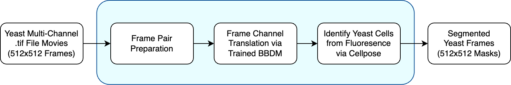
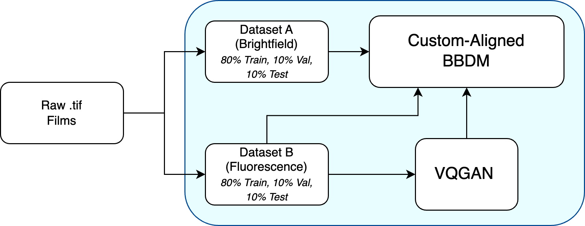

# 💡 YeastLume

### In Active Development

YeastLume is a budding yeast microscopy image processing pipeline that uses diffusion-based generative models to reconstruct fluorescence images from bright-field input. It is trained on paired bright-field and fluorescence images stored in multi-channel .tif files. This repository includes preprocessing tools, training pipelines for the utilized models ([VQGAN](https://github.com/CompVis/taming-transformers/) and [BBDM](https://github.com/xuekt98/BBDM)), and utilities for running inference, evaluation, and segmentation (via [Cellpose](https://github.com/MouseLand/cellpose)).


*Starting from multi-channel .tif microscopy movies, the pipeline extracts frame pairs, translates bright-field frames into synthetic fluorescence using a trained BBDM, and segments the resulting images using Cellpose, returning binary cell masks.*

---

## 🚧 Next Steps / Limitations

This project demonstrates that BBDM can reconstruct fluorescence-like images from bright-field inputs. However, the current pipeline has several important limitations that future work should address:

### 1. **Frame-Wise Splitting Ignores Biological Context**
Currently, frames from the same `.tif` movie are split into training, validation, and test sets independently. This introduces bias due to low variance in the validation set and one of the test sets.

**→ Future direction:** Split data by `.tif` file (i.e., by movie), ensuring no overlap between training, validation, and test videos. This provides a more biologically meaningful evaluation of generalization to unseen time series. Refactor/trim intra-film job logic to only use the new data split paradigm.

### 2. **Colormaps Distort Raw Imaging Data**
Both bright-field and fluorescence channels are converted into RGB images using artificial colormaps. Though this decision was intentional for a proof-of-concept, it may negatively impact downstream segmentation (via Cellpose or other means).  

**→ Future direction:** Keep all data in raw grayscale format throughout preprocessing, training, and inference. Adjust model configs accordingly to accept true high-definition grayscale input/output.

### 3. **Segmentation Does Not Leverage Original Bright-Field**
Currently, segmentation is run only on the reconstructed fluorescence images. However, segmentation models may accept multiple channels from a `.tif` at once.

**→ Future direction:**  
- Run Cellpose using [bright-field, predicted fluorescence] and compare segmentation results to [bright-field, ground-truth fluorescence].  
- Evaluate whether the reconstructed fluorescence actually improves segmentation beyond using bright-field alone.
- Experiment with new SOTA segmentation strategies on fluorescence frames (using labeled ground-truth).

### 4. **Better End-to-End Support**
The repository currently requires significant file handling while data preprocessing steps are being finalized.

**→ Future direction:** Provide full E2E support for a single-entry pipeline. Through Python configuration files, published pre-trained weights (e.g., on Hugging Face), or custom orchestration logic, users should be able to input one or more bright-field images and receive the corresponding binary cell masks, with the intermediate fluorescence frames optionally returned.

---

# ⚙️ Installation and Use
Below are instructions on how to train a BBDM model with paired bright-field and fluorescence data. Steps 1 and 2 assume a local, unix-based environment (e.g., macOS), and the remaining steps assume use on a high-performance cluster (e.g., Hábrók).

### Dataset
- The microscopy datasets used in this project are not publicly distributed, but the pipeline will work with similar .tif input files as long as the installation and preprocessing steps are followed.

### Local Requirements
- 512x512 three-channel .tif films
- Python 3.11+ (with pip)
- Rclone *(if pushing/pulling data)*

### Remote Requirements
- SLURM job scheduler
- Unix/Linux shell with CUDA GPU available
- Conda (via Anaconda3/2024.02-1)
- Rclone *(if pushing/pulling data)*

⚠️ **NOTE:** SLURM job scripts assume YeastLume is in the `$HOME` directory!

---


*Raw .tif movies are split into paired datasets (bright-field and fluorescence), each subdivided into training, validation, and test sets. The VQGAN learns a latent representation of the fluorescence images, and the BBDM is trained to generate these representations from bright-field inputs.*


## 1. Setup Data Preparation
Run the data loading setup script for YeastLume's data preparation.

```shell
./scripts/preprocessing_setup.sh
```

---

## 2. Data Preparation and Preprocessing
BBDM expects data in a particular format for training, validating, and testing. To fulfill these requirements, allow the data preprocessing notebook to create individual, paired image files.

1. Populate the [`data-loading/raw-data`](data-loading/raw-data)  directory with your multi-channel `.tif` files of `512x512` films. These files should be in standard format with bright-field at channel zero and fluorescence at channel one. If data loading fails, please [see the related README](data-loading/README.md).
2. Run the preprocessing script to automatically create the respective data folders.
```shell
./scripts/preprocessing.sh
```

*Note this script does not save notebook output other than the created data directory. In the event of errors, see Line 9 of [`preprocessing.sh`](scripts/preprocessing.sh).*

---

## 3. Remote Data Hosting via Rclone
Hosting the training data can be done via any service; however, this project was developed using Rclone—the University of Groningen's suggested data software module for Hábrók—with Google Cloud Platform. In order to correctly set up Google Drive as a storage space in a headless environment, ensure the following steps are taken on a **new fork (or copy)** of the repository:

1. Create a new Google Cloud Platform project.
2. Under "APIs and Services" → "Enabled APIs & services", click "+ Enable APIs and services" and search for and enable the Google Drive API.
3. Go to "APIs and Services" → "Credentials" and configure a basic consent screen. Configure for external use.
4. Under "Google Auth Platform" → "Data Access", add these scopes to the "Manually add scopes", and leave the resulting boxes ticked: `https://www.googleapis.com/auth/docs,https://www.googleapis.com/auth/drive,https://www.googleapis.com/auth/drive.metadata.readonly`. Note to save changes in the bottom of the pop-up.
5. Under "Google Auth Platform" → "Audience", add yourself as a test user (**ensure the GCP project, your Google Drive, and test user are all the same account**).
6. Under "APIs and Services" → "Credentials", click "+ Create credentials" and select for an OAuth Client ID of type "Desktop app".
7. From the pop-up, download the provided JSON from the bottom-left button.
8. Move the created JSON file into [`accounts/`](./accounts) for convenience. It should automatically be ignored from tracking at this point.
9. Follow the [University of Groningen Hábrók documentation](https://wiki.hpc.rug.nl/habrok/data_management/google_drive) (or a substitute host supporting Rclone), specifically the section *"Loading and configuring the application"*. Copy the appropriate variable names from the Google Cloud Project JSON file and authenticate. Name the remote `gdrive`. This configuration should be done on each machine Rclone is used to push and pull data.
10. Push the model input data to remote (if training the model on a different machine).
```shell
rclone copy -P data/ gdrive:YeastLume/data/
```

*Optional steps if involving multiple researchers/developers are included at the bottom of this document under [Remote Data Hosting via Rclone (cont.)](#remote-data-hosting-via-rclone-cont)*.

---

## 4. Training the VQGAN
BBDM expects a VQGAN checkpoint as input to the model. [The repository links options in its "Pretrained Models" section](https://github.com/xuekt98/BBDM). You can follow their instructions to find an appropriate checkpoint (VQGAN-4, by default).

However, in order to maximize the efficacy of BBDM, it is also possible to train a new VQGAN to learn to reconstruct the fluorescence images in `data/train/B`. The model does not have access to the test set. Prepare the model with the following steps:

1. Pull the model input data from remote (if necessary).
```shell
module load rclone/1.66.0
rclone copy -P gdrive:YeastLume/data/ data/
```

2. Configure the Conda environment for the model ([taming-transformers](https://github.com/CompVis/taming-transformers/)). This script was developed for the University of Groningen's Hábrók, so many install instructions may break on other machines. Please be sure to commit any changes to `custom_vqgan.yaml` beforehand.
```shell
./scripts/gan_setup.sh
```

3. Run the model training script via a dedicated job. This uses the `custom_vqgan.yaml` template.
```shell
sbatch scripts/jobs/train_vqgan_job.sh
```

*In the event of failure, a smaller test job can be run via `sbatch scripts/jobs/debug/train_debug_vqgan_job.sh`. This script is the same as `train_vqgan_job.sh`, except it omits the actual Python call to build the model, and with much lighter GPU[-hour] usage.*

Train the VQGAN until results are as desired (the model will eventually plateau in performance). Then push the created checkpoints to remote for safekeeping. This command assumes only one training log exists. To push to remote otherwise, populate the expanded subpath manually.
```shell
module load rclone/1.66.0
rclone copy -P $(ls -d taming-transformers/logs/*custom_vqgan)/checkpoints gdrive:YeastLume/VQGAN/checkpoints
```
---

## 5. Training the BBDM Model
With a checkpoint to a VQGAN, train the BBDM model with the following steps:

1. Pull the VQGAN checkpoint from remote (or move the file to [`checkpoints/VQGAN`](./checkpoints/VQGAN) manually). Please note that the BBDM model expects the VQGAN `last.ckpt` checkpoint file under [`checkpoints/VQGAN/`](checkpoints/VQGAN/). If this file is not present, the BBDM model will fail to begin training.
```shell
module load rclone/1.66.0
rclone copy -P gdrive:YeastLume/VQGAN/checkpoints/last.ckpt checkpoints/VQGAN/
```

2. Configure the Conda environment for the BBDM model. This script was developed for the University of Groningen's Hábrók, so many install instructions may break on other machines. Please be sure to commit any changes to `environment.yml` beforehand.
```shell
./scripts/bbdm_setup.sh
```

3. Run the model training script via a dedicated job. This uses the `Template-LBBDM-f4.yaml` template (latent space BBDM with a latent depth 4).
```shell
sbatch scripts/jobs/train_bbdm_job.sh
```

*In the event of failure, a smaller test job can be run via `sbatch scripts/jobs/debug/train_debug_bbdm_job.sh`. This script is the same as `train_bbdm_job.sh`, except it omits the actual Python call to build the model, and with much lighter GPU[-hour] usage.*

4. Push the model checkpoints to remote for safekeeping.
```shell
module load rclone/1.66.0
rclone copy -P BBDM/results/YeastLume/LBBDM-f4/checkpoint/ gdrive:YeastLume/BBDM/checkpoints
```

---

## 6. Running Inference on the BBDM Model

1. Pull the best BBDM checkpoint from remote manually. For example, to clone epoch 100, do: `rclone copy -P gdrive:YeastLume/BBDM/results/YeastLume/LBBDM-f4/checkpoint/top_model_epoch_100.pth checkpoints/BBDM`. The name of the checkpoint can be examined on Google Drive.

2. Run the evaluation script. This will write image comparison test results to [`BBDM/results/YeastLume/LBBDM-f4/sample_to_eval/`](./BBDM/results/YeastLume/LBBDM-f4/sample_to_eval/).
```shell
sbatch scripts/jobs/eval_bbdm_job.sh
```

3. Run metrics on the supplied images. PSNR and SSIM measure reconstruction fidelity and structural similarity between predicted and ground-truth fluorescence images, while MSE captures pixel-wise error.
```shell
./scripts/metrics_setup.sh
./scripts/metrics.sh
```

---

## 7. Binary Cell Mask Generation

From the evaluation output fluorescence frames, utilize [Cellpose](https://github.com/MouseLand/cellpose) to create 512x512 binary masks to aid downstream segmentation.

1. Configure the Conda environment for the Cellpose model. This script was developed for the University of Groningen's Hábrók, so many install instructions may break on other machines.
```shell
./scripts/cellpose_setup.sh
```

2. Segment using Cellpose on the evaluation images. Images will be stored in [`segmentation/masks/`](./segmentation/masks).

```shell
sbatch scripts/jobs/cellpose_isolated_job.sh
```

*In the event of failure, a smaller test job can be run via `sbatch scripts/jobs/debug/cellpose_debug_isolated_job.sh`. This script is the same as `cellpose_isolated_job.sh`, except it omits the actual Python call to run the model, and with much lighter GPU[-hour] usage.*

---

# 🖥 Supplementary Install Information

---

## Remote Data Hosting via Rclone (cont.)

Note via [the Remote Data Hosting via Rclone section](#3-remote-data-hosting-via-rclone) that these steps are optional and are only needed if sharing a single Google Drive data setup.

1. Rename the JSON file in [`accounts/`](./accounts) to `drive.json`. 
2. Install [SOPS](https://getsops.io/docs/#download) and run the encryption script, which should create `key` in [`accounts/`](./accounts). This file is more obscure, and can more safely be passed in messages, as it does not directly link to any user space. Changes to the encrypted JSON file are tracked by Git.
```shell
./accounts/encrypt.sh
```
3. When running in a different copy of the repository, bring a copy of the correct `key` back into [`accounts/`](./accounts) manually, and run the decryption script.
```shell
./accounts/decrypt.sh
```

---

## Prevent Committing Output from Notebooks

Add this line to your shell configuration:
```shell
git config filter.strip-notebook-output.clean 'jupyter nbconvert --ClearOutputPreprocessor.enabled=True --to=notebook --stdin --stdout --log-level=ERROR'
```

**[Source](https://gist.github.com/33eyes/431e3d432f73371509d176d0dfb95b6e)**
